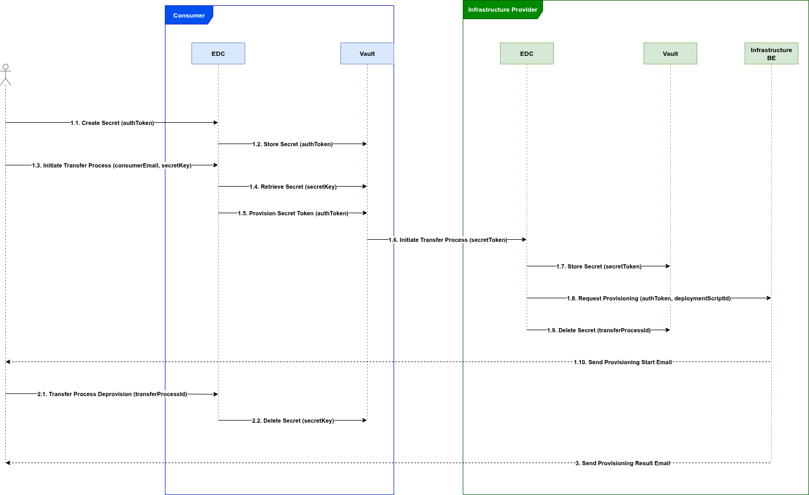

# SIMPL Extension for Eclipse Dataspace Connector - Infrastructure

This repository contains the SIMPL Extension that works with the Eclipse Dataspace Connector allowing operations of provisioning/decomissioning of cloud resources.

## Based on the following

- [Eclipse EDC](https://github.com/eclipse-dataspaceconnector/DataSpaceConnector) - v0.10.1;


## Requirements

You will need the following:
- Java Development Kit (JDK) 17 or higher;
- GIT;
- Linux shell or PowerShell;

## Folders Description

### `extensions`
Contains the source code of the SIMPL Infra Extension.

### `launchers/dev`
Contains the required instructions to run an EDC Connector with the extensions, for testing purposes.

## Modules, Dependencies and Usage

### Modules
The extension has the following modules:

| Module name                                                     | Description                                                                   |
|-----------------------------------------------------------------|-------------------------------------------------------------------------------|
| `eu.europa.ec.simpl.programme.infrastructure.edc:control-plane` | Allows the creation of assets for the SIMPL project                           |
| `eu.europa.ec.simpl.programme.infrastructure.edc:data-plane`    | Allows the triggering process of a deployment script inside the SIMPL context |

### Dependencies
The `control-plane` extension has the following dependencies:

| Module name                          | Description                        |
|--------------------------------------|------------------------------------|
| `org.eclipse.edc:control-plane-core` | Main features of the control plane |
| `org.eclipse.edc:management-api`     | Management API extension           |
| `org.eclipse.edc:secrets-api`        | Management Secrets API extension   |

The `data-plane` extension has the following dependencies:

| Module name                          | Description                     |
|--------------------------------------|---------------------------------|
| `org.eclipse.edc:data-plane-core`    | Main features of the data plane |

### Configurations
The `data-plane` extension has the following configurations:

| Configuration name                            | Description                                                                                                                     |
|-----------------------------------------------|---------------------------------------------------------------------------------------------------------------------------------|
| `edc.infrastructure.simpl.default.auth.token` | Default authentication token send to the Infrastructure BE API if a `secretKey` is not provided in the transfer process request |

### Usage

#### Diagrams

Negotiation and transfer sequence diagram:



#### Payloads

Payload of the creation of an asset, using the `/management/v3/assets/ endpoint` of the Connector:
```
{
    "@context": {
        "@vocab": "https://w3id.org/edc/v0.0.1/ns/")
    },
    "@id": "asset-671",
    "properties": {
        "name": "Test Infrastructure Asset"
    },
    "dataAddress": {
        "type": "Infrastructure",
        "provisioningAPI": "http://localhost:8080/scripts/trigger",
        "deploymentScriptId": "0806537b-a3a6-4527-a6e4-c404647558be"
    }
}
```

| Field name                       | Description                                                                                                 |
|----------------------------------|-------------------------------------------------------------------------------------------------------------|
| `@id`                            | Id of the asset                                                                                             |
| `properties.name`                | Name of the asset                                                                                           |
| `dataAddress.type`               | This extension uses the `Infrastructure` designation                                                        |
| `dataAddress.provioningAPI`      | URL of the triggering module's API that will provision the deployment script on the infrastructure provider |
| `dataAddress.deploymentScriptId` | Id the of deployment script registered on the triggering module                                             |

Triggering of the deployment script, using the `management/v3/transferprocesses` endpoint of the Connector:
```
{
    "@context":{
        "edc":"https://w3id.org/edc/v0.0.1/ns/"
    },
    "connectorId":"provider",
    "counterPartyAddress":"http://localhost:8282/protocol",
    "contractId":"3186afb5-7b10-4665-b07b-233f5665eb98",
    "protocol":"dataspace-protocol-http",
    "transferType": "Infrastructure-PUSH",
    "dataDestination":{
        "type":"Infrastructure",
        "secretKey": "7ad730f9-b380-4cc2-9268-61284dbda6ba"
        "consumerEmail": "someuser@xptodomain.com"
    }
}
```

| Field name                    | Required | Description                                                                                                                                                                                                                                                                                                                                                                                        |
|-------------------------------|----------|----------------------------------------------------------------------------------------------------------------------------------------------------------------------------------------------------------------------------------------------------------------------------------------------------------------------------------------------------------------------------------------------------|
| transferType                  | True     | This extension uses the `Infrastructure-PUSH` designation                                                                                                                                                                                                                                                                                                                                          |
| dataDestination.type          | True     | This extension uses the `Infrastructure` designation                                                                                                                                                                                                                                                                                                                                               |
| dataDestination.secretKey     | False    | Id of the secret stored in the Vault using the [Secrets API](https://eclipse-edc.github.io/Connector/openapi/management-api/#/Secret%20v4alpha). This secret's value will be send as `Authorization` header to the infrastructure-be API. If a `secretKey` is not send, the value configured in `edc.infrastructure.simpl.default.auth.token` will be send as `Authorization` header to the Infrastructure BE  API |
| dataDestination.consumerEmail | True     | Email address that will receive the result of the deployment script's provisioning                                                                                                                                                                                                                                                                                                                 |

Note: the scope of this repo is NOT to explain the complete flows (and payloads) of the EDC Connector. If you want to know more please take a look at the [Eclipse EDC Samples](https://github.com/eclipse-edc/Samples).

## Building and Running

```bash
git clone git@github.com:ionos-cloud/edc-simpl-infrastructure.git
./gradlew clean build
```

To run a test provider connector:

```bash
cd launchers/dev/connector-provider
java -Dedc.fs.config=resources/config.properties -jar build/libs/connector-provider.jar
```

To run a test consumer connector:

```bash
cd launchers/dev/connector-consumer
java -Dedc.fs.config=resources/config.properties -jar build/libs/connector-consumer.jar
```